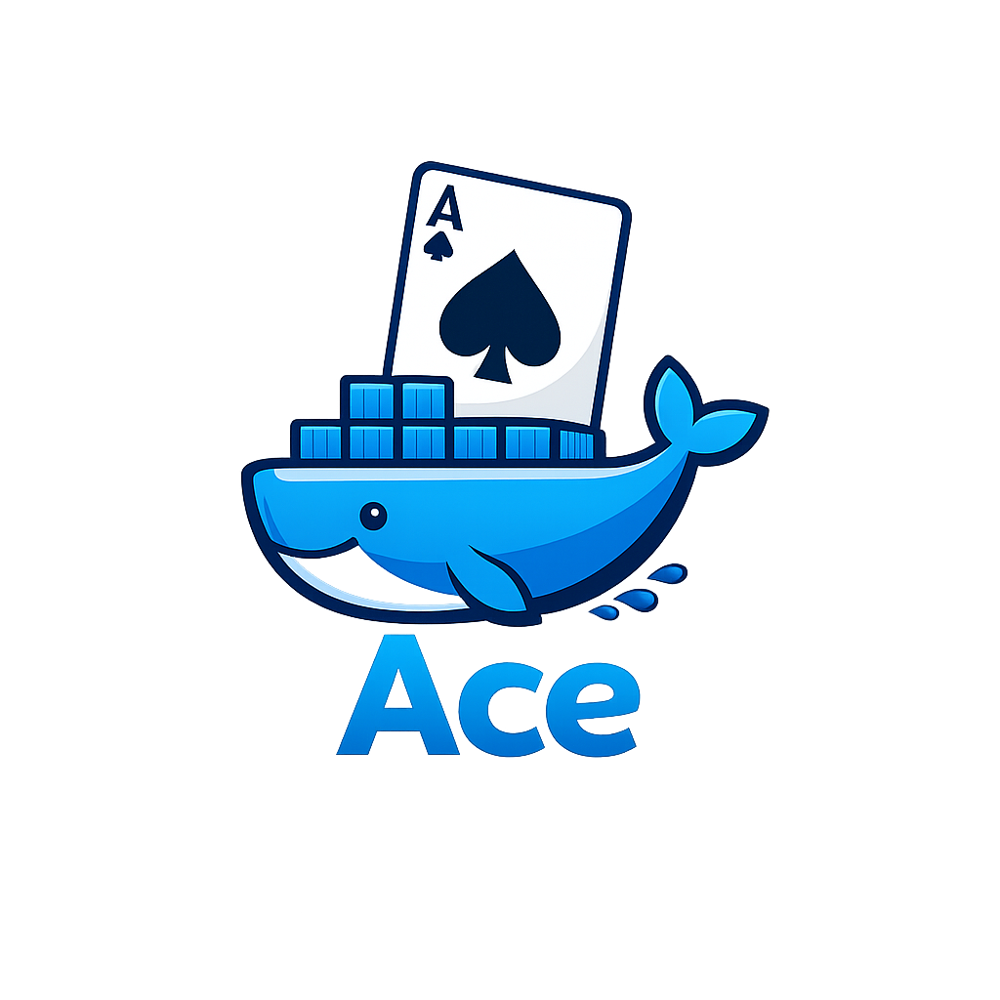

<p align="center">
  
</p>
---


# ACE Server - STILL IN BETA TESTING
### Your own AI website, portable and easy
Run your own AI web app locally or on a server - no subscriptions, no locked platform, just your own stack.
### A self-hosted AI app with ACE architecture
ACE is a lightweight AI web app you can run on your own machine or server. It gives you a browser-based chat interface, account system, chat history, optional public tunnel support, and ACE modes like ACW and ACWFULL.


## Quickstart Guide
### Step 1: Download ACE
Clone the repo or download the source from GitHub.
```bash
git clone https://github.com/mont127/ACE-server1
cd ACE-server1

```
### Step 2: Start ACE
If you are using Docker:
```bash
docker build -t ace:latest .
docker run -d --name ace --restart unless-stopped -p 8000:8000 ace:latest

```
Then open: http://127.0.0.1:8000
### Step 3: Create your account
Open ACE in your browser and sign up. You can enable login verification, email 2FA, persistent sessions, and more if you want a more production-style setup.
### Step 4: Start chatting
That is it. Type into the chat box and use:
 * ACW for standard ACE mode
 * ACWFULL for heavier multi-pass reasoning mode
## Optional: Expose ACE to the internet
Want a public link? Run:
```bash
cloudflared tunnel --url http://127.0.0.1:8000

```
Cloudflared will generate a temporary public URL like: https://something.trycloudflare.com
**Note:** Quick Cloudflare tunnels are temporary. If you want a stable domain, use a named tunnel and your own domain later.
## Features
 * Browser-based AI chat UI
 * ACW and ACWFULL modes
 * Local account system
 * Chat history
 * SQLite database
 * Docker support
 * Optional Cloudflare tunnel
 * Optional email 2FA
 * Optional Google login support
 * Portable, self-hostable architecture
## FAQ
**What is ACE?**
ACE is a self-hosted AI web app with its own frontend, auth system, chat history, and deployable architecture. You run it yourself, either locally or on a server.
**Is it free?**
Yes. Completely free and self-hosted.
**Is this a hosted API service?**
No. ACE is something you run yourself.
**Can I use it locally only?**
Yes. That is actually one of the main use cases.
**Can I make it public?**
Yes. The easiest way is with Cloudflare Tunnel.
**Does it support accounts?**
Yes. ACE supports sign-up, login, sessions, and optional 2FA.
**Does it support persistent chat history?**
Yes. Messages are stored in SQLite.
**Is it production-ready?**
Not fully. ACE is still in beta. It already works, but hardening and polish are ongoing.
**Can I run it without Docker?**
Yes, but Docker is the easiest path right now.
**Does it work on weak hardware?**
Yes, but heavier modes like ACWFULL will be slower on CPU-only systems.
## Architecture
ACE is built around a simple idea:
 * A local/self-hosted web app
 * An AI backend
 * A persistent database
 * An optional public tunnel
 * Configurable auth and session handling
This means ACE can be used as a personal local AI site, a private LAN tool, a home-lab AI panel, or a small shared AI instance for testing.
## Security Notes
ACE includes basic security features, but public deployment still requires care. Recommended for public exposure:
 * Strong session secret
 * Persistent database volume
 * Email 2FA and proper SMTP setup
 * Cloudflare tunnel instead of direct port forwarding
 * Rate limiting
 * Disabling public signup if needed
If you are exposing ACE publicly, assume you are now operating a real internet-facing service.
## Docker
### Basic run
```bash
docker build -t ace:latest .
docker run -d --name ace --restart unless-stopped -p 8000:8000 ace:latest

```
### With persistent DB and env file
```bash
docker volume create ace_data
docker volume create ace_hf_cache
docker run -d --name ace --restart unless-stopped \
  -p 8000:8000 \
  --env-file .env \
  -v ace_data:/app/data \
  -v ace_hf_cache:/data/hf \
  ace:latest

```
## Environment Variables
Example .env:
```text
ACE_ENABLE_FULL_MODE=1
ACE_SESSION_HMAC_SECRET=YOUR_LONG_RANDOM_SECRET
ACE_CHAT_RPM=30
ACE_FULL_CHAT_RPM=6
ACE_LOGIN_RPM=12
ACE_SIGNUP_RPM=6
ACE_2FA_ENABLED=1
ACE_2FA_OTP_TTL_SECONDS=600
ACE_2FA_CODE_LENGTH=6
ACE_2FA_MAX_ATTEMPTS=6
ACE_SMTP_HOST=smtp.gmail.com
ACE_SMTP_PORT=587
ACE_SMTP_USER=your_email@gmail.com
ACE_SMTP_PASS=your_app_password
ACE_SMTP_FROM=ACE <your_email@gmail.com>
ACE_SMTP_TLS=1
ACE_SMTP_SSL=0

```
## Manual Run (for nerds)
If you want to run without Docker:
```bash
python3 -m venv .venv
source .venv/bin/activate
pip install -r requirements.txt
uvicorn ace_server:app --host 0.0.0.0 --port 8000

```
Then open: http://127.0.0.1:8000
## Planned Direction
ACE is moving toward being a more portable app experience. Planned goals include:
 * Easier first-run setup
 * Release packages
 * Smoother local desktop launch flow
 * Stable tunnel/domain support
 * Stronger auth stack
 * Model routing improvements
 * Better UI polish
 * Easier self-hosting for non-technical users
## Contributors
Want to contribute? PRs are welcome.
## Special Thanks
ACE builds on the work of a lot of great open source software:
| Project | What it does |
|---|---|
| FastAPI | API framework |
| Uvicorn | ASGI server |
| SQLite | Local database |
| Transformers | Model loading/inference |
| PyTorch | ML runtime |
| Cloudflared | Public tunnel support |
Made with ambition, bad sleep, and too many rebuilds.
Contact: deepwokenpersona@gmail.com
